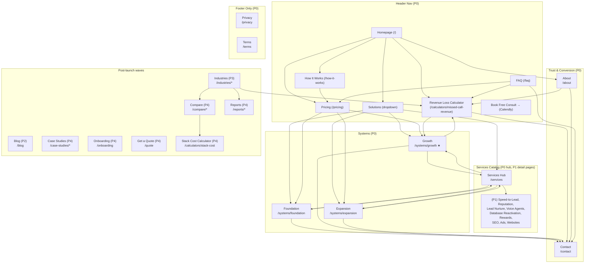

# KeyLime Marketing — Site Architecture

> **Purpose.** Full site map, URL structure, navigation spec, and internal linking plan for KeyLime Marketing's public website. Built from `business-context.md`, `product-marketing-context.md`, `personas.md`, `content-strategy.md`, and `Business_Product_Documentation.md`.
>
> **Site type:** Professional services — managed marketing system for local service businesses (service/SaaS hybrid)
>
> **Conversion strategy:** Layered funnel, not a single "book a call" funnel. Different pages serve different stages of buyer intent. The Book Free Consult CTA is persistent in the header and footer on every page, but is *not* the primary CTA on most pages — using it everywhere dulls it and pattern-matches to every other local agency.
>
> - **Primary (TOFU, low commitment):** Revenue Loss Calculator on the homepage hero. Standalone canonical at `/calculators/missed-call-revenue`. No email required to start.
> - **Secondary (MOFU, email-gated):** Calculator result-screen email gate (saves PDF + enters nurture sequence). Post-launch: Field Reports at `/reports/[slug]` add a non-calculator MOFU on-ramp.
> - **Tertiary (BOFU, high intent):** Book a free consult via embedded Calendly. Primary CTA on system pages and `/contact`; reachable from every page via persistent header/footer.
> - **Quaternary (custom scope):** At launch, specialized-work prospects (full SEO programs, Google/Meta Ads, custom Webflow, large bespoke builds) route through `/contact` with a "looking for custom work?" callout. Post-launch: dedicated `/quote` form replaces the Contact-form handoff.
>
> **Deprecated:** The legacy "Free Digital Presence Audit" lead magnet has been retired. Audit-style language ("get a free audit," "we'll review your digital presence") must not appear in CTAs or page copy. Any `/audit` route should 301-redirect to `/calculators/missed-call-revenue`.
>
> **Hero anchor:** Homepage hero is loss-led. H1 = "See what missed calls are costing your business." Primary CTA = "Calculate my missed-call revenue." Secondary text link = "See how the system works." See §5.1 for full spec.
>
> **Naming conventions:**
>
> - "**System**" = a tier offering (Foundation / Growth / Expansion). URLs: `/systems/[slug]`. Nav: under the **Solutions** dropdown → **Systems** column.
> - "**Service**" = an individual capability in the catalog (the 12 platform solutions + 3 specialized solutions). URLs: `/services` (catalog hub) and `/services/[slug]` (detail pages — post-launch). Nav: under the **Solutions** dropdown → **Services** link.
> - "**Solutions**" = the parent nav grouping that contains both Systems and Services. Not a URL; pure nav widget.
> - "**Calculators**" = TOFU/MOFU tools at `/calculators/[slug]`.
> - "**Reports**" = post-launch field reports at `/reports/[slug]`.
> - "**Compare**" = post-launch comparison pages at `/compare/[slug]`.
>
> **Stack:** Next.js App Router on Vercel — all routes map to `app/` directory. TailwindCSS, TypeScript, React. HighLevel CRM for lead capture, Calendly for booking, GA4 + GTM for analytics.

---

## 0. Initial Launch Strategy

The site ships in five waves. Wave 0 is the lean public launch; Waves 1–4 add the funnel-deepening pages that the launch wave intentionally defers.

### 0.1 Launch wave (P0 — ship together)

13 pages cover the minimum viable site: clear positioning, transparent pricing, the loss-led calculator, the trust pages, and the conversion endpoints.

| # | Page                          | URL                                 | Notes                                                                            |
| - | ----------------------------- | ----------------------------------- | -------------------------------------------------------------------------------- |
| 1 | Homepage                      | `/`                                 | Loss-led hero + embedded missed-call calculator + vertical framing inline        |
| 2 | How It Works                  | `/how-it-works`                     | Plain-language managed-system explainer                                          |
| 3 | Pricing                       | `/pricing`                          | Three-system comparison + custom-work callout (routes to `/contact`)             |
| 4 | Foundation                    | `/systems/foundation`               | $99/mo system deep-dive                                                          |
| 5 | Growth                        | `/systems/growth`                   | $195/mo system deep-dive (featured)                                              |
| 6 | Expansion                     | `/systems/expansion`                | $495/mo system deep-dive                                                         |
| 7 | Services                      | `/services`                         | Catalog hub for all 12 platform + 3 specialized solutions — anchor sections only |
| 8 | Revenue Loss Calculator       | `/calculators/missed-call-revenue`  | Standalone canonical; same calculator embedded in homepage hero                  |
| 9 | About                         | `/about`                            | Team credibility + managed-system story + inline social proof                    |
| 10 | FAQ                          | `/faq`                              | Objection resolution + organic-search question targets                           |
| 11 | Contact                      | `/contact`                          | Calendly embed + form + "looking for custom work?" callout                       |
| 12 | Privacy Policy               | `/privacy`                          | Legal                                                                            |
| 13 | Terms of Service             | `/terms`                            | Legal                                                                            |

Plus a 301 redirect: `/audit` → `/calculators/missed-call-revenue`.

### 0.2 Post-launch waves (P1–P4 — add in sequence)

| Wave | Adds                                                          | Why this order                                                                                              |
| ---- | ------------------------------------------------------------- | ------------------------------------------------------------------------------------------------------------ |
| P1   | Individual service pages: `/services/[slug]`                  | Long-tail SEO surface for the 6 highest-search-intent solutions; expands the catalog from anchors to dedicated pages |
| P2   | Blog: `/blog`, `/blog/[slug]`, `/blog/category/[slug]`        | Content engine for organic acquisition; hub-and-spoke into services and systems                              |
| P3   | Industries: `/industries`, `/industries/home-services`, `/industries/beauty` | Vertical landing surfaces with industry-tuned calculator variants — primary paid-acquisition pages           |
| P4   | Case Studies, Compare, Reports, Onboarding, Get a Quote       | Final funnel-deepening layer: social proof, MOFU comparison pages, MOFU field reports, BOFU trust pages, and dedicated specialized-work quote flow |

### 0.3 Launch-wave decisions (audit fixes baked in)

Five trade-offs the launch wave makes vs. the mature architecture in §5 onward — and how each is handled at launch:

1. **Specialized-work conversion has no dedicated `/quote` page.** Prospects asking for full SEO programs, Google/Meta Ads management, custom Webflow builds, or large bespoke workflow projects route through `/contact`. The Contact page surfaces a "looking for custom work?" callout above the form, and the Contact form includes a "What are you looking for?" multi-select field (Discovery call / Custom SEO / Custom Ads / Custom website / Large workflow build / Something else) that tags the lead in HighLevel for proper internal routing. The Pricing page and system pages link to `/contact` (not a placeholder `/quote`) for custom-work conversations.
2. **No `/services/[slug]` detail pages at launch — `/services` is anchor-only.** The Services catalog hub hosts every solution as an on-page anchor section (`/services#speed-to-lead`, `/services#reputation-management`, etc.). Internal links to solutions from the homepage, system pages, and FAQ use these anchors. P1 promotes the highest-search-intent solutions (Speed-to-Lead, Reputation Management, Lead Nurture, Voice Agents, Database Reactivation, Rewards, plus the three specialized: SEO, Ads, Websites) from anchors to dedicated detail pages.
3. **No industries pages at launch — homepage carries vertical framing.** The homepage includes a substantive "Built for home services and beauty" section with vertical-specific pain points, persona snapshots, and the industry-tuned calculator variants surfaced inline (industry selector on the calculator drives the default benchmarks). Paid acquisition during the launch wave runs to the homepage with UTM tagging for vertical attribution; once `/industries/[slug]` ships in P3, paid acquisition rebases there.
4. **No field reports at launch — calculator result screen is the only MOFU email capture.** The "interested but not ready" visitor's path to the nurture sequence is the calculator's result-screen email gate ("Save my result + see the playbook"). Visitors who don't engage with the calculator have no email-gated MOFU entry. Acceptable trade-off — P4 adds field reports and restores the second MOFU on-ramp.
5. **No case studies = social proof must live inline.** Homepage and About both feature testimonials, client logos, and named-business proof points at launch. No `/case-studies` page exists yet — P4 adds it once KeyLime-tier results mature.

### 0.4 Launch-wave navigation

**Header nav (5 items + CTA):**

1. How It Works
2. Solutions (dropdown — mega menu: Systems column + Services link)
3. Pricing
4. Revenue Loss Calculator
5. FAQ
6. **[Book Free Consult →]** (primary CTA, links to Calendly)

The Solutions dropdown shows:

```
┌──────────────────────────────────────────────────┐
│  SYSTEMS                       SERVICES          │
│  Foundation — $99/mo           See all services →│
│  Growth — $195/mo ★            (/services)       │
│  Expansion — $495/mo                             │
│  ───────────────────────                         │
│  Compare all systems →                           │
│  (/pricing)                                      │
└──────────────────────────────────────────────────┘
```

- "Systems" column shows all three system links + "Compare all systems →" → `/pricing`
- "Services" column has one link → `/services`
- Growth gets a small accent badge (★ or `MOST POPULAR`) because it's the most common starting system for serious operators

**Footer (launch wave):**

| Column           | Header           | Links                                                                                          |
| ---------------- | ---------------- | ---------------------------------------------------------------------------------------------- |
| Brand + CTA      | Logo + tagline   | Location, phone, email, **[Book Free Consult →]** button                                       |
| The System       | THE SYSTEM       | How It Works · Foundation · Growth · Expansion · Compare Pricing                               |
| Services         | SERVICES         | All Services (link to `/services` hub)                                                         |
| Tools            | TOOLS            | Revenue Loss Calculator                                                                        |
| Company          | COMPANY          | About · FAQ · Contact                                                                          |

**Bottom bar:** `© 2026 KeyLime Marketing` · Privacy · Terms · `Built in Southwest Florida — Serving local businesses nationwide`

As post-launch pages ship, they're added to the footer in the appropriate column:

- **P1 (`/services/[slug]`):** Top 6 service pages get promoted to the SERVICES column (e.g., Speed-to-Lead, Reputation Management, Voice Agents, SEO, Ads, Websites). "All Services" link stays.
- **P2 (Blog):** New COMPANY column entry "Blog."
- **P3 (Industries):** New COMPANY column entries (Industries hub + Home Services + Beauty).
- **P4 (Case Studies, Compare, Reports, Onboarding, Get a Quote):**
  - "Case Studies" → COMPANY column
  - "Compare your stack" link → TOOLS column (with sub-items added: Mindbody, Housecall Pro, Vagaro)
  - "Field Reports" link → TOOLS column (with sub-items added per published report)
  - "Onboarding" → COMPANY column
  - "Get a Quote" → COMPANY column (or a new GET STARTED column)

### 0.5 Launch-wave internal linking map

| From                                | To                                              | Anchor text                                                  |
| ----------------------------------- | ----------------------------------------------- | ------------------------------------------------------------ |
| `/` (hero)                          | `/calculators/missed-call-revenue` (or inline)  | "Calculate my missed-call revenue"                           |
| `/` (system snapshot)               | `/systems/growth`                               | "Most popular: Growth →"                                     |
| `/` (services snapshot)             | `/services`                                     | "See every capability →"                                     |
| `/` (vertical framing)              | `/calculators/missed-call-revenue?industry=hvac` and `?industry=beauty` | Industry-tuned calculator links inline       |
| `/how-it-works` (final CTA)         | `/pricing`                                      | "Ready to pick a system? →"                                  |
| `/pricing` (custom-work callout)    | `/contact`                                      | "Need a custom SEO program, ads management, or a custom website? Talk to us →" |
| `/pricing` (system rows)            | `/systems/foundation` · `/systems/growth` · `/systems/expansion` | "See [System] details →"                  |
| `/systems/foundation` (services included) | `/services#[anchor]` per included service | Anchor link into the Services hub                            |
| `/systems/growth` (services included)     | `/services#[anchor]` per included service | Anchor link into the Services hub                            |
| `/systems/expansion` (services included)  | `/services#[anchor]` per included service | Anchor link into the Services hub                            |
| `/systems/[any]` (custom-work)      | `/contact`                                      | "Need a custom-scoped program? Talk to us →"                 |
| `/systems/[any]` (calculator nudge) | `/calculators/missed-call-revenue`              | "Not sure if [System] is right? Run the numbers first →"     |
| `/services` (per anchor section)    | `/systems/[relevant]`                           | "Included in [System] →"                                     |
| `/calculators/missed-call-revenue` (result screen) | `/systems/growth`                | "See the system that fixes this →"                           |
| `/calculators/missed-call-revenue` (result screen) | Calendly                         | "Talk through this with us →" (secondary)                    |
| `/about` (final CTA)                | Calendly                                        | "Book a free consult. 30 minutes. No pitch deck."            |
| `/about` (still-scoping link)       | `/calculators/missed-call-revenue`              | "Still scoping the problem? Run the numbers →"               |
| `/faq` (system answers)             | `/systems/[relevant]` · `/pricing`              | Inline within answers                                        |
| `/faq` (custom-work answers)        | `/contact`                                      | "Talk to us about a custom quote →"                          |
| `/faq` (missed-call answers)        | `/calculators/missed-call-revenue`              | "Run the numbers on your own business →"                     |
| `/contact` (custom-work callout)    | (same page — Contact form)                      | "Looking for custom work?" → routes to multi-select field    |

Every page has Book Free Consult in the header and footer; that's the persistent BOFU CTA across the launch wave.

---

## 1. Page Hierarchy (ASCII Tree)

Each node is tagged with its launch wave: **(P0)** = initial launch, **(P1–P4)** = post-launch waves per §0.2.

```
Homepage (/)                                                   (P0)
├── How It Works (/how-it-works)                               (P0)
├── Pricing (/pricing)                                         (P0)  ← system comparison hub
├── Systems
│   ├── Foundation (/systems/foundation)                       (P0)
│   ├── Growth (/systems/growth)                               (P0)
│   └── Expansion (/systems/expansion)                         (P0)
├── Services (/services)                                       (P0)  ← catalog hub (anchor sections at launch)
│   ├── Speed-to-Lead (/services/speed-to-lead)                (P1)
│   ├── Reputation Management (/services/reputation-management)(P1)
│   ├── Lead Nurture (/services/lead-nurture)                  (P1)
│   ├── Voice Agents (/services/voice-agents)                  (P1)
│   ├── Database Reactivation (/services/database-reactivation)(P1)
│   ├── Rewards (/services/rewards)                            (P1)
│   ├── SEO (/services/seo)                                    (P1)
│   ├── Google & Meta Ads (/services/ads)                      (P1)
│   └── Custom Websites (/services/websites)                   (P1)
├── Calculators
│   └── Revenue Loss (/calculators/missed-call-revenue)        (P0)
│   └── Stack Cost (/calculators/stack-cost)                   (P4)
├── About (/about)                                             (P0)
├── FAQ (/faq)                                                 (P0)
├── Contact (/contact)                                         (P0)
├── Privacy Policy (/privacy)                                  (P0)
├── Terms of Service (/terms)                                  (P0)
├── Blog (/blog)                                               (P2)
│   ├── [Post] (/blog/[slug])                                  (P2)
│   └── [Category] (/blog/category/[slug])                     (P2)
├── Industries (/industries)                                   (P3)
│   ├── Home Services (/industries/home-services)              (P3)
│   └── Beauty & Personal Services (/industries/beauty)        (P3)
├── Case Studies (/case-studies)                               (P4)
│   └── [Individual case study] (/case-studies/[slug])         (P4)
├── Compare (/compare)                                         (P4)  ← optional index
│   ├── KeyLime + Mindbody (/compare/mindbody)                 (P4)
│   ├── KeyLime + Housecall Pro (/compare/housecall-pro)       (P4)
│   ├── KeyLime + Vagaro (/compare/vagaro)                     (P4)
│   ├── KeyLime + ServiceTitan (/compare/servicetitan)         (P4)
│   └── KeyLime + Generic SaaS Stack (/compare/saas-stack)     (P4)
├── Reports (/reports)                                         (P4)  ← optional index
│   ├── HVAC Missed Calls (/reports/missed-calls-hvac)         (P4)
│   ├── Beauty Review ROI (/reports/review-roi-beauty)         (P4)
│   ├── Multi-Location Marketing (/reports/multi-location-marketing) (P4)
│   └── SaaS Stack Audit (/reports/saas-stack-audit)           (P4)
├── Onboarding (/onboarding)                                   (P4)
└── Get a Quote (/quote)                                       (P4)
```

**Depth rationale:** 3 levels max. `/systems`, `/services`, `/industries`, `/calculators`, `/compare`, `/reports`, and `/case-studies` are the only Level 1 categories with Level 2 children. Blog posts and case study slugs are the only Level 3 content. Every important page is reachable within 2 clicks from the homepage.

**Services catalog notes (launch posture):**

- At launch, `/services` is a single page hosting every solution as an on-page anchor section. Internal links use `/services#[anchor]` format (`/services#speed-to-lead`, `/services#voice-agents`, etc.).
- In P1, the 9 priority solutions (6 platform + 3 specialized) get promoted to dedicated `/services/[slug]` pages. The remaining 6 platform solutions (Lead Pipeline / CRM, Booking, Unified Inbox, Birthday Campaigns, Chatbots, Appointment Reminders) stay as anchor sections inside `/services`.

**Calculator notes:**

- `/calculators/missed-call-revenue` is the only calculator at launch. It's the standalone canonical version AND is embedded in the homepage hero. Industry-tuned defaults are surfaced via query params (`?industry=hvac`, `?industry=beauty`).
- `/calculators/stack-cost` ships with the Compare pages in P4 — not earlier.

---

## 2. Visual Sitemap (Mermaid)



---

## 3. URL Map Table

Phase column: **P0** = launch, **P1–P4** = post-launch waves per §0.2.

| Page                            | URL                                       | Parent       | Nav Location                  | Phase | Notes                                                          |
| ------------------------------- | ----------------------------------------- | ------------ | ----------------------------- | ----- | -------------------------------------------------------------- |
| Homepage                        | `/`                                       | —            | Header (logo)                 | P0    | Loss-led hero with embedded missed-call calculator + inline vertical framing + inline social proof |
| How It Works                    | `/how-it-works`                           | Homepage     | Header                        | P0    | Plain-language explainer of the managed-system model           |
| Pricing                         | `/pricing`                                | Homepage     | Header                        | P0    | System comparison + custom-work callout (routes to `/contact`) |
| Foundation                      | `/systems/foundation`                     | Pricing      | Solutions dropdown            | P0    | $99/mo system deep-dive                                        |
| Growth                          | `/systems/growth`                         | Pricing      | Solutions dropdown            | P0    | $195/mo system deep-dive — featured                            |
| Expansion                       | `/systems/expansion`                      | Pricing      | Solutions dropdown            | P0    | $495/mo system deep-dive                                       |
| Services                        | `/services`                               | Homepage     | Solutions dropdown            | P0    | Catalog hub — anchor sections only at launch                   |
| Speed-to-Lead                   | `/services/speed-to-lead`                 | Services     | Footer (Services)             | P1    | Missed-call text-back — top SEO target                         |
| Reputation Management           | `/services/reputation-management`         | Services     | Footer (Services)             | P1    | Foundation inclusion — top SEO target                          |
| Lead Nurture                    | `/services/lead-nurture`                  | Services     | Footer (Services)             | P1    | Expansion inclusion / Foundation+Growth add-on                 |
| Voice Agents                    | `/services/voice-agents`                  | Services     | Footer (Services)             | P1    | AI receptionist — strong long-tail search                      |
| Database Reactivation           | `/services/database-reactivation`         | Services     | Footer (Services)             | P1    | Easy-revenue pitch — high conversion intent                    |
| Rewards                         | `/services/rewards`                       | Services     | Footer (Services)             | P1    | Beauty industry retention hook                                 |
| SEO                             | `/services/seo`                           | Services     | Footer (Services)             | P1    | Specialized work — custom-quoted                               |
| Google & Meta Ads               | `/services/ads`                           | Services     | Footer (Services)             | P1    | Specialized work — custom-quoted                               |
| Custom Websites                 | `/services/websites`                      | Services     | Footer (Services)             | P1    | Specialized work — custom-quoted                               |
| Revenue Loss Calculator         | `/calculators/missed-call-revenue`        | Homepage     | Header + Footer (Tools)       | P0    | Standalone canonical; also embedded in homepage hero           |
| About                           | `/about`                                  | Homepage     | Footer (Company)              | P0    | Team credibility, managed-system story, inline social proof    |
| FAQ                             | `/faq`                                    | Homepage     | Header + Footer (Company)     | P0    | Objection resolution                                           |
| Contact                         | `/contact`                                | Homepage     | Footer (Company)              | P0    | Calendly embed + form + custom-work multi-select field         |
| Privacy Policy                  | `/privacy`                                | Homepage     | Footer (Legal)                | P0    | Legal requirement                                              |
| Terms of Service                | `/terms`                                  | Homepage     | Footer (Legal)                | P0    | Legal requirement                                              |
| Blog                            | `/blog`                                   | Homepage     | Footer (Company)              | P2    | Launch after content strategy and first 4+ posts ready         |
| [Blog Post]                     | `/blog/[slug]`                            | Blog         | Footer (Company)              | P2    | SEO content                                                    |
| [Blog Category]                 | `/blog/category/[slug]`                   | Blog         | Footer (Company)              | P2    | Topic clusters                                                 |
| Industries Hub                  | `/industries`                             | Homepage     | Header dropdown root          | P3    | Two industry pages live below                                  |
| Home Services                   | `/industries/home-services`               | Industries   | Header dropdown               | P3    | HVAC, plumbing, roofing, etc. + tuned calculator               |
| Beauty & Personal Services      | `/industries/beauty`                      | Industries   | Header dropdown               | P3    | Salons, med spas, lash/brow, nails + tuned calculator          |
| Case Studies                    | `/case-studies`                           | Homepage     | Footer (Company)              | P4    | Results hub                                                    |
| [Case Study]                    | `/case-studies/[slug]`                    | Case Studies | Footer (Company)              | P4    | Individual client result                                       |
| Stack Cost Calculator           | `/calculators/stack-cost`                 | Homepage     | Footer (Tools)                | P4    | Ships with Compare pages                                       |
| Compare Hub                     | `/compare`                                | Homepage     | Footer (Tools)                | P4    | Index — can launch as stub                                     |
| KeyLime + Mindbody              | `/compare/mindbody`                       | Compare      | Footer (Tools) / Beauty       | P4    | Beauty stack                                                   |
| KeyLime + Housecall Pro         | `/compare/housecall-pro`                  | Compare      | Footer (Tools) / Home Services| P4    | Home services stack                                            |
| KeyLime + Vagaro                | `/compare/vagaro`                         | Compare      | Footer (Tools) / Beauty       | P4    | Beauty stack                                                   |
| KeyLime + ServiceTitan          | `/compare/servicetitan`                   | Compare      | Footer (Tools)                | P4    | Enterprise home services                                       |
| KeyLime + Generic SaaS Stack    | `/compare/saas-stack`                     | Compare      | Footer (Tools)                | P4    | "I'm paying for 5 disconnected tools" catch-all                |
| Reports Hub                     | `/reports`                                | Homepage     | Footer (Tools)                | P4    | Index — can launch as stub                                     |
| Field Report — HVAC Missed Calls| `/reports/missed-calls-hvac`              | Reports      | Footer (Tools)                | P4    | Email-gated PDF                                                |
| Field Report — Review ROI Beauty| `/reports/review-roi-beauty`              | Reports      | Footer (Tools)                | P4    | Email-gated PDF                                                |
| Field Report — Multi-Location   | `/reports/multi-location-marketing`       | Reports      | Footer (Tools)                | P4    | Marcus persona                                                 |
| Field Report — SaaS Stack Audit | `/reports/saas-stack-audit`               | Reports      | Footer (Tools)                | P4    | Rachel persona                                                 |
| Onboarding                      | `/onboarding`                             | Homepage     | Footer (Company)              | P4    | 4–8 week process detail                                        |
| Get a Quote                     | `/quote`                                  | Homepage     | Footer (Company)              | P4    | Replaces the Contact-form handoff for specialized-work scoping |

**Deprecated / redirect:**

| Route       | Status     | Replacement                                                  |
| ----------- | ---------- | ------------------------------------------------------------ |
| `/audit`    | Retired    | 301 redirect to `/calculators/missed-call-revenue`           |
| `/solutions` (legacy)| Renamed | 301 redirect to `/services`                          |
| `/tiers/*` (legacy)  | Renamed | 301 redirect to `/systems/*`                         |

---

## 4. Navigation Spec

### 4.1 Header Navigation (P0)

**Desktop layout:** Logo (left) → Nav links (center/right) → CTA button (far right)

**Nav items (5 + CTA):**

| Order | Label                       | Destination                                 | Type               |
| ----- | --------------------------- | ------------------------------------------- | ------------------ |
| 1     | How It Works                | `/how-it-works`                             | Link               |
| 2     | Solutions                   | (dropdown — Systems + Services)             | Dropdown           |
| 3     | Pricing                     | `/pricing`                                  | Link               |
| 4     | Revenue Loss Calculator     | `/calculators/missed-call-revenue`          | Link               |
| 5     | FAQ                         | `/faq`                                      | Link               |
| 6     | **Book Free Consult →**     | Calendly                                    | Primary CTA button |

**Solutions dropdown (mega menu — opens on hover/click):**

```
┌──────────────────────────────────────────────────────────┐
│  SYSTEMS                       SERVICES                  │
│                                                          │
│  Foundation — $99/mo           See all services →        │
│  Growth — $195/mo ★            (/services)               │
│  Expansion — $495/mo                                     │
│                                                          │
│  ──────────────────────                                  │
│  Compare all systems →                                   │
│  (/pricing)                                              │
└──────────────────────────────────────────────────────────┘
```

- **Systems column** lists all three system links + "Compare all systems →" (footer of column) → `/pricing`. Growth shows a small accent badge (`★` or `MOST POPULAR`).
- **Services column** has one link: "See all services →" → `/services`.
- Post-P1, the Services column expands to surface the top service links inline alongside the catalog link (matching the v2.0 mega-menu pattern: Platform Solutions + Specialized Work).

**Behavior notes (per `styleguide.md` once published):**

- Sticky, transparent at top, gains soft shadow on scroll past 80px.
- Logo: wordmark in display family, links to `/`.
- Nav links: body-family, medium weight, citrus-accent underline on hover.
- CTA button: always visible — never collapses into mobile menu.

### 4.2 Mobile Navigation (P0)

- Hamburger (left) → Logo (centered) → CTA button (right, always visible)
- Full-screen warm-neutral overlay on open, centered display-family links.
- Solutions expands to reveal Systems (Foundation / Growth / Expansion) and Services (one link to `/services`) within the mobile menu.
- Menu order: How It Works → Solutions → Pricing → Revenue Loss Calculator → FAQ → About → Contact

### 4.3 Footer Navigation (P0 launch)

**5-column layout on desktop:**

| Column           | Header           | Links                                                                                       |
| ---------------- | ---------------- | ------------------------------------------------------------------------------------------- |
| Brand + CTA      | Logo + tagline   | Location (Southwest Florida, serving nationally), phone, email, **[Book Free Consult →]**   |
| The System       | THE SYSTEM       | How It Works · Foundation · Growth · Expansion · Compare Pricing                            |
| Services         | SERVICES         | All Services (→ `/services`)                                                                |
| Tools            | TOOLS            | Revenue Loss Calculator                                                                     |
| Company          | COMPANY          | About · FAQ · Contact                                                                       |

**Bottom bar:** `© 2026 KeyLime Marketing` · Privacy · Terms · `Built in Southwest Florida — Serving local businesses nationwide`

> Collapse to 2 columns on tablet and a single accordion on mobile.

### 4.4 Footer evolution (post-launch additions)

As each wave ships, the footer absorbs the new pages in the columns indicated below. No restructure — just additions.

| Wave | Footer additions                                                                                                                                       |
| ---- | ------------------------------------------------------------------------------------------------------------------------------------------------------- |
| P1   | **Services** column promoted from "All Services" to a list: Speed-to-Lead · Reputation Management · Voice Agents · Lead Nurture · SEO · Ads · Websites · All services |
| P2   | **Company** column adds: Blog                                                                                                                           |
| P3   | **Company** column adds: Industries · Home Services · Beauty                                                                                            |
| P4   | **Company** column adds: Case Studies · Onboarding · Get a Quote. **Tools** column adds: Stack Cost Calculator · Compare your stack (→ `/compare`) · Field Reports (→ `/reports`) |

### 4.5 Breadcrumbs

Implement on all pages below the homepage. Format mirrors URL path.

| Page                                | Breadcrumb                                            |
| ----------------------------------- | ----------------------------------------------------- |
| `/systems/growth`                   | Home > Pricing > Growth                               |
| `/services`                         | Home > Services                                       |
| `/services/speed-to-lead`           | Home > Services > Speed-to-Lead                       |
| `/calculators/missed-call-revenue`  | Home > Calculators > Revenue Loss                     |
| `/calculators/stack-cost`           | Home > Calculators > Stack Cost                       |
| `/industries/home-services`         | Home > Industries > Home Services                     |
| `/industries/beauty`                | Home > Industries > Beauty & Personal Services        |
| `/compare/mindbody`                 | Home > Compare > KeyLime + Mindbody                   |
| `/compare/housecall-pro`            | Home > Compare > KeyLime + Housecall Pro              |
| `/reports/missed-calls-hvac`        | Home > Field Reports > Why Local HVAC Companies Lose 30% |
| `/case-studies/[slug]`              | Home > Case Studies > [Client Name]                   |
| `/blog/[slug]`                      | Home > Blog > [Post Title]                            |

`/systems/[slug]` breadcrumbs read "Home > Pricing > [System]" rather than "Home > Systems > [System]" because the user-facing parent in the IA is `/pricing` (the comparison page), not the abstract `/systems` namespace. The `/systems` URL prefix exists for clean URL structure; there's no standalone `/systems` page.

Add `BreadcrumbList` schema markup on all breadcrumb instances (see schema-markup skill).

---

## 5. Page-Level Specs

### 5.1 Homepage (/) — P0

**Conversion goal (primary):** Calculator entry — Revenue Loss Calculator (loss-led hero).
**Conversion goal (secondary):** `/how-it-works` (for the visitor who wants context before the calculator).
**Conversion goal (tertiary):** System pages or Calendly for visitors who self-identify.

**Loss-led hero reference frame (from `business-context.md`):**

- **H1:** See what missed calls are costing your business.
- **Sub:** Local home services and beauty operators lose thousands a month to leads that called the next business on the list. Punch in three numbers — get yours in 60 seconds.
- **Primary button:** Calculate my missed-call revenue → opens the calculator inline or navigates to `/calculators/missed-call-revenue`
- **Secondary text link:** See how the system works → `/how-it-works`

The calculator is embedded above the fold — the hero is the calculator entry, not a teaser pointing to one. Avoid generic "Get started," "Get a free audit," or "Book a call" in the hero.

**Section order (launch wave):**

1. Nav
2. Hero (loss-led + calculator entry)
3. Trust bar (industries served + client logos — social proof inline since no `/case-studies` at launch)
4. Problem agitation ("Stop juggling 6 tools, 5 logins, 4 invoices")
5. How It Works (3-step)
6. The Three Systems (comparison snapshot — Foundation / Growth ★ / Expansion)
7. Services Snapshot (the 12+3, grouped — links to `/services#[anchor]` sections)
8. **Built for home services and beauty** (vertical framing — replaces `/industries` at launch)
   - Two-column layout: Home Services pain points / Beauty pain points
   - Persona snapshots (Mike + Lena framing)
   - Industry selector on the calculator surfaces the tuned defaults inline
9. Testimonials + named-business proof points (social proof inline since no `/case-studies` at launch)
10. Pricing transparency callout → `/pricing`
11. FAQ snapshot (3–5 top objections) → `/faq`
12. Final CTA — two-path: "Run the numbers first" → calculator + "Skip ahead — book a free consult" → Calendly
13. Footer

**Key internal links to push:** `/calculators/missed-call-revenue` (primary CTA), `/systems/growth` (most-common entry), `/services` (catalog), `/pricing` (transparency anchor), `/contact` (specialized-work routing).

**Post-launch evolution:**

- **P3 (Industries):** The "Built for home services and beauty" section gets stripped down to a "Find your industry" snapshot routing to `/industries/home-services` and `/industries/beauty`. The vertical framing moves to those pages.
- **P4 (Case Studies):** The inline testimonials get supplemented by a case study grid linking to `/case-studies`.
- **P4 (Compare):** Add a "Already on Mindbody / Housecall Pro / Vagaro?" callout linking to `/compare/[stack]`.
- **P4 (Reports):** Add a field reports snapshot block.

### 5.2 How It Works (/how-it-works) — P0

**Purpose:** Plain-language explainer of the managed-system model — "you run the business, we run the marketing." Defuses the implicit "is this SaaS or an agency" question.

**Conversion goal (primary):** `/pricing`. **Secondary:** Book Free Consult. **Tertiary:** calculator (for the visitor who skipped past it from the homepage).

**Sections:**

1. Hero — "One team. One platform. One monthly price."
2. The three steps: 1) Pick a system, 2) We onboard you in 4–8 weeks, 3) The system runs (and we run the system)
3. What's included on every account (Twilio number, A2P 10DLC compliance, HighLevel sub-account, baseline workflows)
4. What you actually use (Unified Inbox, CRM, reports — that's it)
5. What we do behind the scenes (workflows, automations, integrations, reporting)
6. Final CTA — "Ready to pick a system?" → `/pricing`. Or "Book a free consult and we'll help you pick." → Calendly. Plus calculator link for visitors still scoping the problem.

### 5.3 Pricing (/pricing) — P0

**Purpose:** The decision page. Comparison table for all three systems, clear callout for custom-quoted specialized work, and pricing FAQ.

**Conversion goal (primary):** Book Free Consult. **Secondary:** calculator. **Tertiary at launch:** `/contact` for visitors who already know they want custom-scoped work.

**Sections:**

1. Hero — "Three systems. One monthly price. Pick the one that fits today — you can move up or down anytime."
2. Full comparison table (Foundation / Growth / Expansion across all 16 solutions, setup fee, contract terms)
3. "Featured" treatment on Growth column
4. Custom-quoted specialized work callout — "Need a full SEO program, ads management, or a custom website? We quote those based on scope, not from a template. Talk to us →" → links to `/contact` at launch; switches to `/quote` in P4.
5. Add-on solutions explainer — "Anything not in your system can be added on at a published price." → links to `/services`
6. Pricing-specific FAQ (what's included, contract terms, setup fee, system moves, cancellation)
7. CTA — "Book a free consult and we'll help you pick the right system"

### 5.4 System Pages (/systems/[slug]) — P0

Each of the three system pages follows the same template, with content tuned per system.

**Conversion goal (primary):** Book Free Consult. **Secondary:** calculator. **Tertiary at launch:** `/contact` (Growth and Expansion especially, for visitors planning to add custom specialized work).

**Sections:**

1. Hero — System name, price, one-line value prop, primary CTA (Book Free Consult)
2. **Calculator nudge** — Below the hero: "Not sure if [System] is right? See what missed calls are costing you first →" linking to `/calculators/missed-call-revenue`. The calculator does its own qualification work.
3. Who it's for — persona description (Mike for Growth, Sofia for Foundation, James/Marcus for Expansion)
4. Everything included — full list of services, specialized work (where applicable), and infrastructure (Twilio, A2P 10DLC, HighLevel sub-account). Each included service deep-links to `/services#[anchor]`.
5. What you can add on — published-price add-ons relevant to this system
6. Custom-quoted specialized work available — Ads, full SEO, custom website (Growth and Expansion tiers especially). At launch: "Talk to us about a custom quote →" routes to `/contact`. In P4: switches to `/quote`.
7. Onboarding timeline for this system
8. System-specific FAQ (3–5 questions)
9. System-specific CTA — Book Free Consult, plus "View comparison →" link to `/pricing`

**Growth system (`/systems/growth`)** gets special treatment:

- Featured card treatment in the Solutions dropdown
- Most prominent CTA placement
- Highest-volume internal links from services hub, homepage, FAQ
- Strongest social proof slot (testimonials from Mike-type and Lena-type personas — inline since no `/case-studies` at launch)
- Receives the dominant system recommendation from the calculator result screen

**Expansion system (`/systems/expansion`)** is the upsell anchor:

- Cross-link to custom Webflow examples in `/services#websites` (P0) or `/services/websites` (P1+)
- Cross-link to `/contact` (P0) or `/quote` (P4) for the ads/SEO scope-up moment
- Multi-location callout for the Marcus persona — "Running multiple locations? Talk to us about per-location Expansion."

### 5.5 Services Hub (/services) — P0 (anchor-only), evolves in P1

**Purpose at launch:** Single-page catalog hosting every solution as an on-page anchor section. Owner-facing: "Here's everything we run." Search-facing: long-tail keyword surface for "what is missed call text back," "marketing automation for service business," etc.

**Conversion goal (primary):** Route to relevant system page. **Secondary:** Book Free Consult. **Tertiary:** calculator link.

**Launch-wave sections (anchor structure):**

1. Hero — "Twelve platform solutions. Three specialized services. One managed system."
2. Group A: **Capture every lead**
   - `#speed-to-lead` Speed-to-Lead
   - `#booking` Booking
   - `#chatbots` Chatbots
   - `#voice-agents` Voice Agents
3. Group B: **Convert and retain**
   - `#crm` Lead Pipeline (CRM)
   - `#lead-nurture` Lead Nurture
   - `#appointment-reminders` Appointment Reminders
   - `#database-reactivation` Database Reactivation
4. Group C: **Reputation and growth**
   - `#reputation-management` Reputation Management
   - `#unified-inbox` Unified Inbox
   - `#birthday-campaigns` Birthday Campaigns
   - `#rewards` Rewards
5. Group D: **Specialized work (custom-quoted)**
   - `#seo` SEO
   - `#ads` Google & Meta Ads
   - `#websites` Custom Websites
6. Add-on pricing callout — "Some of these are in every system. Some are system-specific. Anything not in your system can be added on."
7. Final CTA — `/pricing` and Book Free Consult.

**Each anchor section template:**

- Solution name + one-line outcome
- Plain-language explanation (1–2 paragraphs)
- "Included in [systems]" callout — deep-link to relevant `/systems/[slug]`
- Pricing — "Included in [System] · Add-on at $X · Custom-scoped" (whichever applies)
- Specialized-work anchors (`#seo`, `#ads`, `#websites`) include a "Talk to us about a custom quote →" CTA routing to `/contact` (P0) or `/quote` (P4)

**Post-launch evolution (P1):** The 9 priority solutions (Speed-to-Lead, Reputation Management, Lead Nurture, Voice Agents, Database Reactivation, Rewards, SEO, Ads, Websites) get promoted to dedicated `/services/[slug]` pages. Anchor sections become teaser cards linking to the detail pages. The remaining 6 solutions (CRM, Booking, Chatbots, Unified Inbox, Birthday Campaigns, Appointment Reminders) stay as on-page sections.

### 5.6 Service Detail Pages (/services/[slug]) — P1

Each linked service page follows the same template.

**Conversion goal (primary):** Book Free Consult. **Secondary:** calculator (where topically relevant — Speed-to-Lead, Voice Agents especially). **Tertiary:** Route to the most relevant system page.

**Sections:**

1. Hero — Solution name, one-line outcome ("Never miss another lead while you're on the job"), primary CTA
2. What it does — plain-language explanation of the solution
3. The problem it solves — pain point in operator language (drawn from `personas.md`)
4. How it works in practice — concrete example for both target industries
5. Which systems include it — table or callout showing inclusion across Foundation / Growth / Expansion (or "add-on" status if not in any system)
6. Pricing — included in [System] $X / available as add-on at $Y / quoted per engagement
7. **Embedded calculator entry** (where topically relevant — Speed-to-Lead and Voice Agents especially)
8. **Related field report** (where one exists, post-P4) — secondary CTA
9. Related services — 2–3 cross-links to complementary service pages
10. Service-specific FAQ (3–5 questions)
11. CTA — Book Free Consult (and `/quote` for specialized work, post-P4)

**The 3 specialized service pages (`/services/seo`, `/services/ads`, `/services/websites`)** have a variant template:

- Pricing section says "Quoted per engagement based on scope" instead of a number
- Primary CTA is `/contact` (P1, until /quote exists) → `/quote` (P4+)
- Includes a "What we ask before quoting" section so the prospect knows what info will be gathered

### 5.7 Revenue Loss Calculator (/calculators/missed-call-revenue) — P0

**Purpose:** Standalone canonical version of the homepage hero calculator. Single-purpose tool. Three inputs, one result, one CTA on the result screen. The calculator is the lead magnet — not a teaser for one. The result PDF is the email gate; entering the calculator itself requires no email.

**Conversion goal (primary):** Completion. **Secondary (on result screen):** email submission to save the result PDF + enter the nurture sequence (this is the launch wave's primary MOFU capture). **Tertiary (on result screen):** Book Free Consult ("Your calculated loss is $X/mo — want to talk about a Growth-system fix? →").

**Inputs (three):**

- Average ticket size (or appointment value)
- Estimated missed calls per week (or "I don't know" → benchmark default by industry)
- Industry (Home Services / Beauty — drives benchmark defaults)

**Output:** Estimated monthly missed-call revenue loss. Plus a recovery estimate ("With missed-call text-back, operators in your industry typically recover 30–50% of these. Your recovered range: $X–$Y/mo.") — only publish with verified ranges; placeholder until then.

**Result screen CTAs:**

- Primary: "Save my result + see the playbook" (email gate → PDF + nurture sequence entry)
- Secondary: "Talk through this with us" (Calendly — Book Free Consult)
- Tertiary: "See the system that fixes this" → `/systems/growth`

**Industry-tuned variants (launch wave):** The same calculator surfaced inline in the homepage "Built for home services and beauty" section with an industry selector that toggles defaults and labels. Home Services variant says "missed calls = lost jobs"; Beauty variant says "missed calls = unbooked appointments."

**Trust signals on the entry screen:**

- "No email required to start."
- "Three numbers. Sixty seconds."
- "Yours to keep regardless."

**Voice notes.** Tight calculator copy. Six to ten words per label. No instructions. No "please enter." Just the input. The calculator is the moment the prospect stops being suspicious — make it feel like a tool, not a Trojan horse. No "free!" or "instant!" exclamations. No "powered by KeyLime" branding on the calculator UI itself. The result page is where the brand voice comes back — calm, direct, useful.

**Internal linking priorities.**

- Inbound: homepage hero, every system page (calculator nudge), `/services` (callout in Speed-to-Lead / Voice Agents anchors), `/about`, `/faq`, footer.
- Outbound only from the result screen: system page (Growth default), Calendly, (post-P4) relevant field report.

### 5.8 About (/about) — P0

**Purpose:** Team credibility and the managed-system story. Most important page for breaking down the "I've been burned before" objection and the "is this just another agency" objection. Carries inline social proof at launch (testimonials + named-business proof points) since `/case-studies` doesn't ship until P4.

**Conversion goal (primary):** Book Free Consult. **Secondary:** calculator link (for visitors still scoping the problem).

**Sections (launch wave):**

1. Hero — plain, direct ("We run marketing systems for local service businesses. That's it.")
2. The story — why KeyLime exists, the service/SaaS hybrid origin, the industry focus on home services and beauty
3. How we work — single point of contact per client, written gameplan deliverable, in-house team supported by vetted specialists
4. Where we work — based in Southwest Florida, serving local businesses nationally
5. Our values — plain-English communication, fair pricing, fit-for-purpose systems, no lock-in on the core subscription
6. **Current client roster + testimonials** (inline social proof — launch-wave substitute for `/case-studies`)
7. CTA — "Book a free consult. 30 minutes. No pitch deck." Plus calculator link below.

**Post-launch evolution (P4):** Once `/case-studies` ships, the inline roster + testimonials in section 6 trim down to a snapshot linking to the case studies hub.

### 5.9 FAQ (/faq) — P0

**Purpose:** Standalone FAQ for organic search ("what is missed-call text-back", "marketing for HVAC pricing", "how does HighLevel work for small business") and to support visitors who want to read before booking.

**Conversion goal (primary):** Book Free Consult. **Secondary:** calculator (for missed-call questions) or `/contact` (for custom-work questions). **Tertiary post-P4:** field report (for "how do you measure X?" answers) or `/compare/[stack]` (for tool integration questions).

**Structure:** 15–25 questions organized into sections:

- **The System & Pricing** (what's included, system moves, what's an add-on vs. specialized work, contract terms, cancellation)
- **Onboarding** (timeline, what's involved, single point of contact)
- **Industries** (do you work with my specific trade / specialty)
- **Working with existing tools** (Mindbody, Boulevard, ServiceTitan, Housecall Pro, Jobber — answers route to `/contact` at launch; to `/compare/[stack]` in P4)
- **Compliance & Infrastructure** (A2P 10DLC, Twilio numbers, data ownership, what happens if I cancel)
- **Custom work** (full SEO, ads management, custom websites — answers route to `/contact` at launch; to `/quote` in P4)

Add FAQ schema markup (see schema-markup skill).

### 5.10 Contact (/contact) — P0 (carries specialized-work routing at launch)

**Purpose:** Two paths — book via Calendly or submit via contact form. Both feed the same HighLevel CRM. At launch, also serves as the destination for specialized-work prospects (since `/quote` hasn't shipped yet) via a "looking for custom work?" callout and a multi-select project-type field on the contact form.

**Conversion goal (primary):** Book Free Consult (Calendly). **Secondary:** form submission. **Tertiary at launch:** custom-work routing via form multi-select; the multi-select tags the lead in HighLevel for proper internal routing.

**Sections:**

1. Brief "Let's talk" headline and subhead
2. Embedded Calendly (primary)
3. Contact form below (secondary):
   - Name
   - Business name
   - Industry (Home Services / Beauty / Other)
   - Phone
   - Email
   - **What are you looking for?** (multi-select):
     - Discovery call (general)
     - Custom SEO program
     - Custom Google/Meta Ads management
     - Custom Webflow website
     - Large workflow / automation build
     - Something else
   - Brief description
4. Phone number and email as direct links
5. **"Looking for custom work?" callout** above the form: "If you already know you need a custom SEO program, Ads management, a custom website, or a large workflow build, use the form below and select the right project type. We respond within 1–2 business days with a written scope and price."
6. Location: Southwest Florida — serving local businesses nationally

**Post-launch evolution (P4):** Once `/quote` ships, the specialized-work callout and multi-select trim down. The Contact form becomes a simpler "Discovery call vs. message us" handoff, with custom-work prospects routed to `/quote`. The contact-form multi-select drops the four custom-work options.

### 5.11 Industries Hub + Pages (/industries, /industries/[slug]) — P3

Deferred to P3. At launch, vertical-specific framing lives inline on the homepage in the "Built for home services and beauty" section (§5.1). When the dedicated industry pages ship:

**Industries Hub (/industries):**

- Two-card landing page routing to `/industries/home-services` and `/industries/beauty`
- "Not in either of these?" callout — politely route out per the anti-persona in `product-marketing-context.md`

**Industry Pages (/industries/[slug]):**

- Industry-tuned missed-call calculator as the **primary CTA** (loss-led hero matching the homepage but vertical-specific)
- Industry-specific pain points (drawn from personas)
- How KeyLime fits the industry — workflows, language, integrations, benchmarks
- Recommended system (Growth is default)
- Industry-specific service highlights
- Tool integration callout linking to relevant `/compare/[stack]` pages
- Industry-specific case study spotlight (once available)
- Industry-specific FAQ
- Final CTA — Book Free Consult + calculator

When industries ship, they replace the homepage "Built for home services and beauty" section as the primary paid-acquisition landing surface. Homepage continues to carry a "Find your industry" snapshot.

### 5.12 Blog (/blog) — P2

Defer to post-launch. When launched:

- Target topics by audience:
  - Home services: missed-call recovery, local SEO for trades, GBP optimization, review generation playbooks
  - Beauty: salon retention, no-show reduction, birthday and rewards campaigns, Instagram for studios
  - Cross-industry: tool consolidation math, A2P 10DLC in plain English, what to ask a marketing partner
- Hub-and-spoke model: pillar posts link to service pages, system pages, industry pages (P3+), comparison pages (P4+), and field reports (P4+)
- **CTA by funnel stage:**
  - TOFU posts → calculator (P2) or field report (P4+)
  - MOFU posts → calculator or `/contact` (P2) → `/quote` (P4+)
  - BOFU posts → system page + Book Free Consult

### 5.13 Case Studies (/case-studies, /case-studies/[slug]) — P4

Deferred to P4. At launch, social proof lives inline on the homepage and About via testimonials and named-business proof points (Four Leaf Charters, Verona Cabinets, Mycelia Foundation, Mega Kovas, ord-x, Virtue Sod). Populate `/case-studies` as KeyLime-tier results mature.

**Hub page structure (when shipped):**

- Hero — "Real businesses. Real systems. Real results."
- Client roster card grid (filterable by industry once 6+ studies exist)
- "What a typical engagement looks like" bridge content
- CTA — "Want results like these? Book a free consult."

**Individual case study template:** Client header, the challenge, what we did, results (numbers, before/after), client quote, "what we'd do differently next time" optional candor block, CTA with system recommendation.

### 5.14 Stack Cost Calculator + Compare Pages (/calculators/stack-cost, /compare/[stack]) — P4

Deferred to P4. Ships as a paired set: the stack cost calculator and the comparison pages that embed it.

**Stack Cost Calculator (/calculators/stack-cost):**

- Inputs: current core tool (Mindbody / Vagaro / Boulevard / Housecall Pro / ServiceTitan / Jobber / Other) with known monthly cost pre-filled. Plus checkboxes for typical add-on tools (Podium, Mailchimp, separate texting, Linktree, etc.) each with editable cost.
- Output: side-by-side current stack cost vs. KeyLime [recommended system] cost.
- Result screen CTAs: email gate (save comparison) → Calendly → system page.

**Comparison Pages (/compare/[stack]):**

Launch slate for P4: `/compare/mindbody`, `/compare/housecall-pro`, `/compare/vagaro`. Phase 4-extended: `/compare/servicetitan`, `/compare/saas-stack`.

Shared template: hero with "Already on [X]? See what KeyLime adds — and what it can replace." Primary CTA: "Calculate your stack cost →" to `/calculators/stack-cost?stack=[X]`. Honest opener (don't trash the competitor). Gap list (4–6 operator-language bullets). Typical stack add-ons tallied. Embedded stack cost calculator. "What stays vs. what we replace" table. Integration explainer. System recommendation. Stack-specific FAQ. Final CTA — calculator + Book Free Consult.

### 5.15 Field Report Pages (/reports/[slug]) — P4

Deferred to P4. Launch slate: `/reports/missed-calls-hvac`, `/reports/review-roi-beauty`. Phase 4-extended: `/reports/multi-location-marketing`, `/reports/saas-stack-audit`.

**Shared template:** Hero (report title + 1-line description + email-gated download CTA), what's in it (4–6 specific bullets), who wrote it / who it's for, preview spread, form (max 4 fields), what happens next (PDF + 3–4 follow-up notes), related reports.

When reports ship, they become the second MOFU email-capture on-ramp alongside the calculator result screen.

### 5.16 Onboarding (/onboarding) — P4

Deferred to P4. At launch, the 4–8 week onboarding process is summarized within `/how-it-works` and on each system page. When the dedicated page ships:

**Sections:** Hero ("From kickoff to a working system in 4 to 8 weeks"), Week 1 (Discovery), Weeks 2–3 (Platform setup), Weeks 3–5 (Gameplan and build), Weeks 5–8 (Activation and training), what's included in the $200 setup fee, single-point-of-contact callout, CTA.

### 5.17 Get a Quote (/quote) — P4

Deferred to P4. At launch, specialized-work prospects route through `/contact` (see §5.10). When the dedicated page ships, it replaces the Contact-form handoff:

**Purpose:** Lead capture for custom-scoped specialized work — full SEO programs, Google/Meta Ads management, custom Webflow builds, large bespoke workflow projects.

**Sections:** Hero ("Tell us what you're trying to do. We'll send you a real quote."), what we quote (4 categories), what we need to give you an accurate quote (form fields), the form, process ("respond within 1–2 business days"), CTA.

When `/quote` ships, all internal links currently pointing to `/contact` for custom-work scoping migrate to `/quote`. The Contact form simplifies (multi-select drops the four custom-work options).

---

## 6. Internal Linking Plan

### 6.1 Hub Pages and Spokes

**Revenue Loss Calculator** (`/calculators/missed-call-revenue`) is the **TOFU lead-gen hub** at launch:

- Homepage hero (primary CTA, embedded)
- Header nav direct link
- Every system page (calculator nudge under hero)
- `/services` (callout in Speed-to-Lead and Voice Agents anchor sections)
- `/about`, `/how-it-works`, `/faq` (secondary CTA below the primary Book Free Consult link)
- Footer (Tools column)

Post-launch additions:

- P3: Industry pages (embedded as primary CTA with vertical-tuned defaults)
- P2: Blog posts where topic-relevant (TOFU education posts especially)

**Growth system page** (`/systems/growth`) is the **primary commercial conversion hub** at launch:

- Calculator result screen (tertiary CTA from missed-call calculator)
- Homepage hero, services snapshot, and system snapshot
- `/pricing` comparison table → "Most popular: Growth →"
- Solutions dropdown (Systems column — featured)
- `/services` catalog (per-anchor "Included in Growth →" callout)
- Footer (The System column)

Post-launch additions:

- P3: All industry pages → `/systems/growth` (default recommendation)
- P4: All comparison pages → "Most [competitor] users land on Growth →"
- P2: Blog posts on lead capture, reviews, SEO foundations

**Expansion system page** (`/systems/expansion`) is the **upsell / high-value hub**:

- `/pricing` → "Ready for more: Expansion →"
- `/services#websites` (custom Webflow callout)
- `/services#lead-nurture` (Expansion inclusion)
- `/services#rewards` (Expansion inclusion)
- Footer (The System column)

Post-launch additions:

- P3: `/industries/beauty` (Lena-type multi-station owners)
- P4: `/case-studies/[slug]` for multi-location and large operator stories, `/reports/multi-location-marketing`

**Services hub** (`/services`) is the **deep-researcher hub**:

- Header nav (Solutions dropdown → Services column)
- Footer (Services column)
- All system pages — "Full service list →"
- Homepage services snapshot — "See every capability →"

**Specialized-work conversion** routes through `/contact` at launch:

- `/services#seo`, `/services#ads`, `/services#websites` — primary CTA at launch
- `/systems/expansion` — "Want the full ads/SEO program on top of Expansion? Talk to us →"
- `/systems/growth` — "Need full Google Ads management on top of Growth? Talk to us →"
- `/pricing` custom-work callout
- `/faq` custom-work answers

Post-launch (P4): all of the above migrate from `/contact` to `/quote`.

### 6.2 Cross-Section Links (launch wave)

| From                                | To                                              | Anchor text                                                          |
| ----------------------------------- | ----------------------------------------------- | -------------------------------------------------------------------- |
| `/` (hero)                          | `/calculators/missed-call-revenue` (or inline)  | "Calculate my missed-call revenue"                                   |
| `/` (system snapshot)               | `/systems/growth`                               | "Most popular: Growth →"                                             |
| `/` (services snapshot)             | `/services#[anchor]` per service                | "See [Service] →"                                                    |
| `/` (vertical framing)              | `/calculators/missed-call-revenue?industry=hvac` | "See what missed calls are costing your trades business →"          |
| `/` (vertical framing)              | `/calculators/missed-call-revenue?industry=beauty` | "See what missed appointments are costing your salon →"            |
| `/how-it-works` (final CTA)         | `/pricing`                                      | "Ready to pick a system? →"                                          |
| `/pricing` (custom-work callout)    | `/contact`                                      | "Need a custom SEO program, ads management, or a custom website? Talk to us →" |
| `/pricing` (system rows)            | `/systems/[slug]`                               | "See [System] details →"                                             |
| `/systems/foundation` (included services) | `/services#reputation-management`, `#crm`, `#unified-inbox` (etc.) | Anchor links to Services hub      |
| `/systems/growth` (included services)     | `/services#speed-to-lead`, `#booking`, etc. | Anchor links to Services hub                                         |
| `/systems/expansion` (included services)  | `/services#lead-nurture`, `#rewards`, etc.  | Anchor links to Services hub                                         |
| `/systems/[any]` (custom-work)      | `/contact`                                      | "Need a custom-scoped program? Talk to us →"                         |
| `/systems/[any]` (calculator nudge) | `/calculators/missed-call-revenue`              | "Not sure if [System] is right? Run the numbers first →"             |
| `/systems/[any]` (compare)          | `/pricing`                                      | "View comparison →"                                                  |
| `/services` (anchor section header) | `/systems/[relevant]`                           | "Included in [System] →"                                             |
| `/services#seo` / `#ads` / `#websites` | `/contact`                                   | "Talk to us about a custom quote →"                                  |
| `/calculators/missed-call-revenue` (result) | `/systems/growth`                       | "See the system that fixes this →"                                   |
| `/calculators/missed-call-revenue` (result) | Calendly                                | "Talk through this with us →"                                        |
| `/about` (final CTA)                | Calendly                                        | "Book a free consult"                                                |
| `/about` (still scoping)            | `/calculators/missed-call-revenue`              | "Still scoping the problem? Run the numbers →"                       |
| `/faq` (system answers)             | `/systems/[relevant]`, `/pricing`               | Inline                                                               |
| `/faq` (missed-call answers)        | `/calculators/missed-call-revenue`              | "Run the numbers on your own business →"                             |
| `/faq` (custom-work answers)        | `/contact`                                      | "Talk to us about a custom quote →"                                  |
| `/faq` (tool integration answers)   | `/contact`                                      | "Talk to us about integrating with [tool] →" (P4: switches to `/compare/[stack]`) |
| `/contact` (specialized-work)       | (same page — form multi-select)                 | "Looking for custom work? Use the form below and select the project type." |

### 6.3 Cross-Section Links (post-launch additions)

| Wave | From                                | To                                              | Anchor text                                                          |
| ---- | ----------------------------------- | ----------------------------------------------- | -------------------------------------------------------------------- |
| P1   | `/services` anchor sections (9 priority) | `/services/[slug]`                         | "See the full page →"                                                |
| P1   | `/services/speed-to-lead`           | `/calculators/missed-call-revenue`              | "Run the numbers on what missed calls are costing you →"             |
| P1   | `/services/reputation-management`   | `/systems/foundation`                           | "Included in every system — even Foundation →"                       |
| P1   | `/services/voice-agents`            | `/calculators/missed-call-revenue`              | "See what after-hours calls are costing you →"                       |
| P1   | `/services/rewards`                 | `/systems/expansion`                            | "Included in Expansion — see what else is in it →"                   |
| P1   | `/services/seo` / `/ads` / `/websites` | `/contact` (→ `/quote` in P4)                | "Custom-scoped. Talk to us →"                                        |
| P3   | `/industries/home-services`         | `/calculators/missed-call-revenue?industry=hvac` | Industry-tuned calculator CTA                                       |
| P3   | `/industries/beauty`                | `/calculators/missed-call-revenue?industry=beauty` | Industry-tuned calculator CTA                                      |
| P3   | `/industries/home-services`         | `/services/voice-agents`                        | "Capture after-hours calls with Voice Agents →"                      |
| P3   | `/industries/beauty`                | `/services/rewards`                             | "Built-in loyalty for salons and spas →"                             |
| P3   | `/industries/beauty`                | `/services/database-reactivation`               | "Win back lapsed clients with Database Reactivation →"               |
| P4   | All sources currently pointing to `/contact` for custom work | `/quote`             | "Get a custom quote →" (migration)                                   |
| P4   | `/industries/home-services`         | `/compare/housecall-pro`                        | "Already on Housecall Pro? See how your stack stacks up →"           |
| P4   | `/industries/beauty`                | `/compare/mindbody`, `/compare/vagaro`          | "Already on Mindbody / Vagaro? See how your stack stacks up →"       |
| P4   | `/industries/home-services`         | `/reports/missed-calls-hvac`                    | "Read the field report on HVAC missed-call recovery →"               |
| P4   | `/industries/beauty`                | `/reports/review-roi-beauty`                    | "Read the field report on review automation ROI in beauty →"         |
| P4   | `/compare/[stack]`                  | `/calculators/stack-cost?stack=[X]`             | "Calculate your stack cost →" (primary CTA)                          |
| P4   | `/compare/[stack]`                  | `/systems/growth`                               | "Most [competitor] users land on Growth →"                           |
| P4   | `/about`                            | `/case-studies`                                 | "See real results →" (replaces inline testimonials snapshot)         |
| P4   | `/systems/expansion`                | `/reports/multi-location-marketing`             | "Running multiple locations? Read the field report →"                |
| P4   | Calculator result screen            | `/reports/[relevant]`                           | "Read the field report on this →"                                    |
| P2   | `/blog/[post]` (TOFU)               | `/reports/[relevant]` (or calculator if pre-P4) | "Download the field report on [topic] →"                             |
| P2   | `/blog/[post]` (MOFU)               | `/calculators/missed-call-revenue`              | "Run the numbers on your own business →"                             |

### 6.4 Orphan Page Audit (launch wave)

Every P0 page must have at least one inbound internal link:

| Page                                 | Minimum inbound link from                                                                  |
| ------------------------------------ | ------------------------------------------------------------------------------------------ |
| `/how-it-works`                      | Header nav, Homepage hero secondary text link, Footer (The System)                         |
| `/pricing`                           | Header nav, Homepage system snapshot, all system pages, Footer (The System)                |
| `/systems/foundation`                | `/pricing`, Solutions dropdown, Homepage system snapshot, Footer (The System)              |
| `/systems/growth`                    | `/pricing`, Solutions dropdown (featured), Homepage, Footer, calculator result screen      |
| `/systems/expansion`                 | `/pricing`, Solutions dropdown, Homepage, Footer                                           |
| `/services`                          | Solutions dropdown (Services link), Homepage services snapshot, Footer (Services)          |
| `/calculators/missed-call-revenue`   | Header nav, Homepage hero (primary CTA), every system page (calculator nudge), `/about`, `/faq`, Footer (Tools) |
| `/about`                             | Footer (Company), Homepage trust-bar area                                                  |
| `/faq`                               | Header nav, Footer (Company), Homepage FAQ snapshot                                        |
| `/contact`                           | Footer (Company), Pricing custom-work callout, system pages custom-work callouts, FAQ custom-work answers, About final CTA |
| `/privacy`                           | Footer bottom bar                                                                          |
| `/terms`                             | Footer bottom bar                                                                          |

### 6.5 CTA Consistency Rule (launch wave)

Every P0 page must have at least one path to a primary conversion (calculator entry or Book Free Consult — whichever matches the page's funnel stage). Book Free Consult is the persistent header/footer presence on every page.

**Book Free Consult touchpoints (BOFU CTA, P0):**

1. Header nav CTA button (all pages)
2. Footer brand column CTA button (all pages)
3. Homepage final CTA section (two-path with calculator)
4. Each system page hero + final CTA (primary CTA on system pages)
5. `/contact` page (primary)
6. `/about` final CTA
7. `/how-it-works` final CTA
8. `/pricing` final CTA
9. `/faq` final CTA
10. Calculator result screen (secondary CTA after the primary email-gated action)

**Calculator touchpoints (TOFU CTA, P0):**

- Homepage hero (primary, embedded)
- Header nav direct link
- Every system page (secondary CTA — "Not sure if [System] is right? Run the numbers first →")
- `/services` (callout in Speed-to-Lead and Voice Agents anchor sections)
- `/about`, `/how-it-works`, `/faq` (secondary CTA below the primary Book Free Consult link)
- Footer (Tools column — always available)

**Specialized-work routing (P0 — through Contact, P4 — through Quote):**

At launch (P0), `/contact` is the destination for:

- `/services#seo`, `/services#ads`, `/services#websites` anchor section CTAs
- `/systems/growth` and `/systems/expansion` custom-work callouts
- `/pricing` custom-work callout
- `/faq` custom-work answers

In P4, all of these migrate to `/quote`. The Contact form simplifies (multi-select drops the four custom-work options).

---

## 7. Launch Sequence (5 waves)

### P0 — Launch wave (ship together)

13 pages, in the priority order they should be built:

1. **Homepage** (`/`) — loss-led hero with embedded calculator + inline vertical framing + inline social proof
2. **How It Works** (`/how-it-works`)
3. **Pricing** (`/pricing`)
4. **Foundation** (`/systems/foundation`)
5. **Growth** (`/systems/growth`) — featured
6. **Expansion** (`/systems/expansion`)
7. **Services** (`/services`) — catalog hub with anchor sections only
8. **Revenue Loss Calculator** (`/calculators/missed-call-revenue`) — standalone canonical
9. **About** (`/about`) — with inline testimonials and client logos
10. **FAQ** (`/faq`)
11. **Contact** (`/contact`) — with "looking for custom work?" callout and project-type multi-select
12. **Privacy Policy** (`/privacy`)
13. **Terms of Service** (`/terms`)

Plus: 301 redirect `/audit` → `/calculators/missed-call-revenue`.

### P1 — Individual service pages

Promote the 9 priority solutions from `/services` anchor sections to dedicated detail pages:

- `/services/speed-to-lead`
- `/services/reputation-management`
- `/services/lead-nurture`
- `/services/voice-agents`
- `/services/database-reactivation`
- `/services/rewards`
- `/services/seo`
- `/services/ads`
- `/services/websites`

Footer Services column expands to surface the top 6–7 service links.

### P2 — Blog

- `/blog` index
- `/blog/[slug]` post template
- `/blog/category/[slug]` topic clusters

Ship with first 4+ posts ready. Footer Company column adds "Blog."

### P3 — Industries

- `/industries` hub
- `/industries/home-services`
- `/industries/beauty`

Industry-tuned calculator variants surface on each industry page as the primary CTA. The homepage "Built for home services and beauty" section trims down to a "Find your industry" snapshot routing to the dedicated pages. Paid acquisition rebases from homepage to industry pages.

### P4 — Case Studies, Compare, Reports, Onboarding, Get a Quote

- `/case-studies` hub + `/case-studies/[slug]` (populate as KeyLime-tier results mature)
- `/calculators/stack-cost` — pairs with Compare pages
- `/compare` hub (optional index) + `/compare/mindbody`, `/compare/housecall-pro`, `/compare/vagaro` (launch slate)
- `/reports` hub (optional index) + `/reports/missed-calls-hvac`, `/reports/review-roi-beauty` (launch slate)
- `/onboarding`
- `/quote` — replaces the Contact-form handoff for specialized-work scoping

Internal-link migration in P4: every "Talk to us" custom-work CTA currently routing to `/contact` migrates to `/quote`. The Contact form multi-select drops the four custom-work options.

P4-extended (as demand surfaces): `/compare/servicetitan`, `/compare/saas-stack`, `/reports/multi-location-marketing`, `/reports/saas-stack-audit`, additional case studies, additional comparison pages (Boulevard, Jobber, Squarespace + Mailchimp DIY stack), and additional field reports per sales-conversation topics.

---

## 8. SEO Considerations

### Target keyword clusters by page

| Page                                | Primary keyword                                       | Supporting keywords                                                                                            |
| ----------------------------------- | ----------------------------------------------------- | -------------------------------------------------------------------------------------------------------------- |
| Homepage                            | managed marketing for local service business          | marketing system small business, all-in-one marketing for service business, marketing for home services        |
| `/how-it-works`                     | how managed marketing works                           | what is managed marketing, marketing as a service vs agency, marketing platform vs agency                       |
| `/pricing`                          | small business marketing pricing                      | marketing packages for service business, marketing pricing for HVAC, salon marketing pricing                   |
| `/systems/foundation`               | affordable marketing for small business               | $99 marketing for small business, starter marketing package, marketing for new businesses                       |
| `/systems/growth`                   | marketing package for service businesses              | growth marketing for HVAC, salon marketing software package, lead generation system for small business         |
| `/systems/expansion`                | full service marketing for local business             | custom website + marketing, full marketing system for service business, multi-location marketing               |
| `/services`                         | marketing services for service businesses             | what is missed call text back, marketing automation for service business, marketing tools for salons           |
| `/services/speed-to-lead`           | missed call text back                                 | automated text back for missed calls, missed call automation, never miss a lead service business               |
| `/services/reputation-management`   | reputation management for small business              | google review automation, review request software, automated review requests                                    |
| `/services/voice-agents`            | AI receptionist for small business                    | AI phone agent for HVAC, after hours call answering, AI voice agent for salon                                  |
| `/services/database-reactivation`   | database reactivation marketing                       | win back lapsed customers, reactivation campaign for service business, dormant customer reactivation           |
| `/services/rewards`                 | salon loyalty program                                 | loyalty program for service business, customer rewards for salon, referral program software                    |
| `/services/lead-nurture`            | lead nurture automation for small business            | follow up automation, lead nurturing sequence, SMS follow up service business                                  |
| `/services/seo`                     | local SEO for service business                        | SEO for HVAC, SEO for salons, local search marketing service business                                          |
| `/services/ads`                     | Google Ads management for local business              | PPC management HVAC, Meta Ads management for salons, paid ads management service business                      |
| `/services/websites`                | custom website for service business                   | Webflow site for local business, HVAC website design, salon website design                                     |
| `/calculators/missed-call-revenue`  | missed call revenue calculator                        | how much do missed calls cost, missed call ROI calculator, HVAC missed call calculator, salon missed call calculator |
| `/calculators/stack-cost` (P4)      | marketing stack cost calculator                       | marketing tool cost calculator, salon marketing cost calculator, HVAC marketing cost calculator                |
| `/industries/home-services` (P3)    | marketing for home services                           | marketing for HVAC, marketing for plumbers, marketing for roofers, marketing for contractors                   |
| `/industries/beauty` (P3)           | marketing for salons and med spas                     | marketing for salons, marketing for med spas, marketing for lash studios, marketing for nail salons             |
| `/compare/mindbody` (P4)            | Mindbody alternative                                  | Mindbody add-ons, Mindbody marketing integration, what to use with Mindbody                                     |
| `/compare/housecall-pro` (P4)       | Housecall Pro alternative                             | Housecall Pro marketing, Housecall Pro add-ons, what to use with Housecall Pro                                 |
| `/compare/vagaro` (P4)              | Vagaro alternative                                    | Vagaro marketing, Vagaro add-ons, what to use with Vagaro                                                       |
| `/reports/missed-calls-hvac` (P4)   | HVAC missed call recovery                             | how many calls do HVAC companies miss, HVAC inbound call conversion                                             |
| `/reports/review-roi-beauty` (P4)   | review automation ROI for salons                      | salon review automation results, med spa review automation, review marketing ROI beauty                         |
| `/about`                            | KeyLime Marketing                                     | KeyLime Marketing about                                                                                          |
| `/onboarding` (P4)                  | marketing onboarding for small business               | A2P 10DLC for small business (translated), marketing setup process                                              |
| `/quote` (P4)                       | marketing quote for service business                  | custom SEO quote, Google Ads management quote, custom website quote service business                            |
| `/faq`                              | long-tail Q&A queries                                 | varies — covers every objection                                                                                  |
| `/blog/[post]` (P2)                 | long-tail content topics                              | varies by post                                                                                                  |

### URL decisions

- **`/systems/[slug]` (renamed from `/tiers/[slug]`)** — aligns the URL namespace with the new nav label "Systems" and matches the brand language in business-context.md ("three system levels"). `/tiers/*` 301-redirects to `/systems/*` if any v2.0 links exist.
- **`/services` and `/services/[slug]` (renamed from `/solutions` and `/solutions/[slug]`)** — aligns with the new nav structure where "Services" is the catalog and "Solutions" is the parent nav dropdown grouping. `/solutions` 301-redirects to `/services`.
- **`/calculators/[slug]` (plural)** — matches the naming used in `content-strategy.md` and signals a tools library that can grow (`/calculators/lead-roi`, `/calculators/no-show-cost` as future expansions).
- **`/compare/[stack]` not `/vs/[stack]`** — the framing on these pages is "KeyLime + [tool]" (complementary), not "KeyLime vs [tool]" (substitutive). URL captures "[tool] alternative" SEO intent while the on-page H1 frames it as the complementary "and" relationship.
- **`/reports/[slug]` not `/field-reports/[slug]` or `/resources/[slug]`** — short, memorable, easy to link. "Field reports" is the UI label; the URL is `/reports`.
- **`/quote` (short) not `/get-a-quote` or `/custom-quote-request`** — short, memorable, easy to link. Ships in P4.
- **`/audit` is RETIRED** — 301 redirect to `/calculators/missed-call-revenue` shipped in P0.
- **`/case-studies/[slug]` not `/clients/[slug]`** — "case studies" signals proof; "clients" could read as a login area.
- **No dates in blog URLs:** `/blog/missed-call-text-back-roi` not `/blog/2026/05/missed-call-text-back-roi`.
- **No `/highlevel` or `/ghl`-prefixed URLs** — the platform that powers KeyLime is HighLevel, but that's an internal/operational detail.

### Schema markup priorities

- `LocalBusiness` schema on the homepage (Southwest Florida + nationwide service area)
- `Service` schema on each `/services/[slug]` page (P1+)
- `Product` or `Offer` schema on each `/systems/[slug]` page with price (P0)
- `BreadcrumbList` schema on every breadcrumb instance (P0+)
- `FAQPage` schema on `/faq` and on system / service / comparison pages with embedded FAQs (P0+ for FAQ)
- `Organization` schema in the global layout (P0)
- `Article` schema on blog posts and field reports once launched (P2+ for blog, P4+ for reports)
- `HowTo` or `WebApplication` schema on calculator pages where appropriate (P0 for missed-call calculator)

(See `schema-markup` skill for implementation specifics.)

---

*KeyLime Marketing Site Architecture v3.0*
*Re-synced 2026-05-16 from updated `business-context.md`, `product-marketing-context.md`, `personas.md`, `content-strategy.md`, and `Business_Product_Documentation.md`, then refactored around the §0 Initial Launch Strategy.*
*Major changes vs. v2.0: 13-page launch wave defined; nav restructured around Solutions dropdown with Systems + Services columns; tier URLs renamed `/tiers/*` → `/systems/*`; catalog URLs renamed `/solutions` → `/services` and `/solutions/[slug]` → `/services/[slug]`; CTA standardized as "Book Free Consult"; specialized-work routing migrated to `/contact` at launch (with `/quote` deferred to P4); calculator MOFU role expanded to cover both calculator-engagement-only and field-report-style email capture during the launch wave; homepage carries inline vertical framing and inline social proof to substitute for deferred `/industries` and `/case-studies`; post-launch sequence restructured into 5 waves (P0–P4).*
