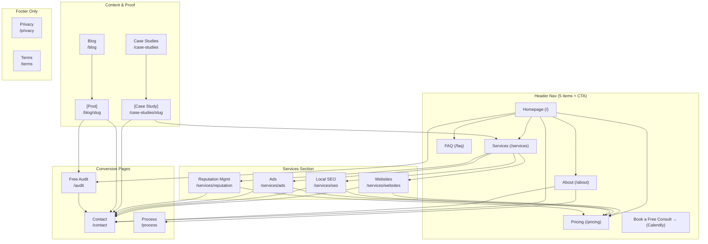

# Linax Digital — Site Architecture

> **Purpose.** Full site map, URL structure, navigation spec, and internal linking plan for linaxdigital.com. Built from `business-context.md`, `personas.md`, `styleguide.md`, and `homepage-wireframe-spec.md`.
>
> **Site type:** Professional services — local digital marketing agency (small business / hybrid)  
> **Primary conversion:** Book free consult (Calendly)  
> **Secondary conversion:** Free Digital Presence Audit lead capture  
> **Stack:** Next.js App Router — all routes map to `app/` directory

---

## 1. Page Hierarchy (ASCII Tree)

```
Homepage (/)
├── Services (/services)
│   ├── Websites (/services/websites)
│   ├── Local SEO (/services/seo)
│   ├── Google & Meta Ads (/services/ads)
│   └── Reputation Management (/services/reputation)
├── Pricing (/pricing)
├── About (/about)
├── Process (/process)
├── Case Studies (/case-studies)
│   └── [Individual case study] (/case-studies/[slug])
├── Free Audit (/audit)
├── FAQ (/faq)
├── Blog (/blog)                          ← Launch later; stub now
│   ├── [Post] (/blog/[slug])
│   └── [Category] (/blog/category/[slug])
├── Contact (/contact)
├── Privacy Policy (/privacy)
└── Terms of Service (/terms)
```

**Depth rationale:** 3 levels max. The /services hub + 4 sub-pages is the only Level 2 content. Case study slugs and blog posts are the only Level 3 content. Every important page is reachable within 2 clicks from the homepage.

---

## 2. Visual Sitemap (Mermaid)




---

## 3. URL Map Table


| Page                  | URL                     | Parent       | Nav Location              | Priority | Notes                            |
| --------------------- | ----------------------- | ------------ | ------------------------- | -------- | -------------------------------- |
| Homepage              | `/`                     | —            | Header (logo)             | P1       | Primary entry point              |
| Services Hub          | `/services`             | Homepage     | Header dropdown root      | P1       | Overview of all 4 services       |
| Websites              | `/services/websites`    | Services     | Header dropdown           | P1       | Lump-sum + subscription pricing  |
| Local SEO             | `/services/seo`         | Services     | Header dropdown           | P1       | One-time + ongoing pricing       |
| Ads                   | `/services/ads`         | Services     | Header dropdown           | P1       | % of ad spend pricing            |
| Reputation Management | `/services/reputation`  | Services     | Header dropdown           | P1       | Flagship service — featured      |
| Pricing               | `/pricing`              | Homepage     | Header                    | P1       | Full pricing table, all services |
| About                 | `/about`                | Homepage     | Header                    | P1       | Founder story, credibility       |
| Process               | `/process`              | Homepage     | Footer (Company)          | P2       | How We Work detail page          |
| Case Studies          | `/case-studies`         | Homepage     | Footer (Resources)        | P2       | Results hub; grows over time     |
| [Case Study]          | `/case-studies/[slug]`  | Case Studies | Footer (Resources)        | P2       | Individual client result         |
| Free Audit            | `/audit`                | Homepage     | Footer (Resources) + Hero | P1       | Lead magnet landing page         |
| FAQ                   | `/faq`                  | Homepage     | Header                    | P2       | Objection resolution             |
| Contact               | `/contact`              | Homepage     | Footer (Company)          | P1       | Form + Calendly embed            |
| Blog                  | `/blog`                 | Homepage     | Footer (Resources)        | P3       | Launch after initial clients     |
| [Blog Post]           | `/blog/[slug]`          | Blog         | Footer (Resources)        | P3       | SEO content                      |
| [Blog Category]       | `/blog/category/[slug]` | Blog         | Footer (Resources)        | P3       | Topic clusters                   |
| Privacy Policy        | `/privacy`              | Homepage     | Footer (Legal)            | P3       | Legal requirement                |
| Terms of Service      | `/terms`                | Homepage     | Footer (Legal)            | P3       | Legal requirement                |


**Priority key:** P1 = launch-critical, P2 = launch with stub or full, P3 = can defer

---

## 4. Navigation Spec

### 4.1 Header Navigation

**Desktop layout:** Logo (left) → Nav links (center/right) → CTA button (far right)

**Nav items (5 max, per style guide §12):**


| Order | Label                     | Destination                 | Type               |
| ----- | ------------------------- | --------------------------- | ------------------ |
| 1     | Services                  | `/services` (with dropdown) | Dropdown           |
| 2     | Pricing                   | `/pricing`                  | Link               |
| 3     | About                     | `/about`                    | Link               |
| 4     | FAQ                       | `/faq`                      | Link               |
| 5     | **Book a free consult →** | Calendly                    | Primary CTA button |


**Services dropdown (opens on hover/click):**

```
┌─────────────────────────────────┐
│  Websites                       │
│  Local SEO                      │
│  Google & Meta Ads              │
│  Reputation Management ★        │
│  ─────────────────────────────  │
│  View all services →            │
└─────────────────────────────────┘
```

- "Reputation Management" gets a small clay badge — `MOST POPULAR` or `★` — to signal the flagship.
- "View all services →" links to `/services`.

**Behavior notes (per style guide §12 and wireframe §3):**

- Sticky, transparent at top, gains `--shadow-sm` on scroll past 80px.
- Logo: Fraunces 22px weight 600, wordmark, links to `/`.
- Nav links: Inter 15px weight 500, `--color-sand-700`, clay underline on hover.
- CTA button: always visible — never collapses into mobile menu.

### 4.2 Mobile Navigation

- Hamburger (left) → Logo (centered) → CTA button (right, always visible)
- Full-screen cream overlay on open, centered Fraunces 32px links.
- Services expands to reveal sub-links within the mobile menu.
- Menu order: Services → Pricing → About → FAQ → Free Audit → Contact

### 4.3 Footer Navigation

**4-column layout on desktop (per wireframe §14 and style guide §13.5):**


| Column       | Header         | Links                                                        |
| ------------ | -------------- | ------------------------------------------------------------ |
| Brand column | Logo + tagline | Location, phone, email                                       |
| Services     | SERVICES       | Websites · Local SEO · Ads · Reputation Management · Pricing |
| Company      | COMPANY        | About · How We Work · Contact · Book a Call                  |
| Resources    | RESOURCES      | Free Digital Presence Audit · Case Studies · FAQ · Blog      |


**Bottom bar:** `© 2026 Linax Digital` · Privacy · Terms · `Made in Southwest Florida`

### 4.4 Breadcrumbs

Implement on all pages below the homepage. Format mirrors URL path.


| Page                    | Breadcrumb                              |
| ----------------------- | --------------------------------------- |
| `/services/websites`    | Home > Services > Websites              |
| `/services/reputation`  | Home > Services > Reputation Management |
| `/case-studies/[slug]`  | Home > Case Studies > [Client Name]     |
| `/blog/[slug]`          | Home > Blog > [Post Title]              |
| `/blog/category/[slug]` | Home > Blog > [Category]                |


Add breadcrumb `BreadcrumbList` schema markup on all breadcrumb instances (see schema-markup skill).

---

## 5. Page-Level Specs

### 5.1 Homepage (/)

**Conversion goal:** Calendly booking (primary), Audit lead capture (secondary)  
**Section order (per wireframe):** Nav → Hero → Trust Bar → Problem Agitation → Services Overview → Results Snapshot → Process → Pricing Overview → FAQ → Final CTA → Footer  
**Ke y internal links to push:** /services/reputation (flagship), /audit (lead magnet), /pricing (transparency differentiator), /about (founder trust)

### 5.2 Services Hub (/services)

**Purpose:** High-level overview of all four services for visitors who arrive from search or nav. Reinforces the four-service model and routes each visitor to the right sub-page.  
**Sections:** Hero (services overview) → 4 service cards (same as homepage section) → Results teaser → CTA  
**Key links out:** /services/[each], /pricing, /contact

### 5.3 Service Pages (/services/[slug])

Each of the four service pages follows the same template:

**Sections:**

1. Hero — service name, one-line value prop, primary CTA (Book a Call)
2. What's included — detailed breakdown of what the service covers
3. Pricing — transparent pricing table for this service
4. Results relevant to this service (stat or case study teaser)
5. Process — how this specific service is delivered (variation of the 4-step process)
6. FAQ — service-specific questions (3–5)
7. Final CTA — dark warm brown section, Calendly CTA

**Reputation Management** (`/services/reputation`) gets special treatment:

- Featured card treatment in nav dropdown
- Cross-sells the platform upsells (SMS, email, loyalty, automations) below main content
- Mentions Go High Level as the platform powering the service (in plain language)

### 5.4 Pricing (/pricing)

**Purpose:** Full transparent pricing table — the strongest differentiator vs. competitors who hide pricing. Addresses the #1 objection ("I don't know what this costs") before the prospect has to ask.

**Sections:**

1. Hero — "Our prices are on the website. No runaround."
2. Pricing table for all 4 services with full option breakdown
3. Billing terms (lump-sum vs. subscription, contract terms, month-to-month language)
4. ROAS guarantee callout
5. FAQ — pricing-specific questions (what's included, contract terms, cancellation)
6. CTA

### 5.5 About (/about)

**Purpose:** Founder credibility, Everyman trust, and the "you talk to the person doing the work" differentiator. Most important page for breaking down the "I've been burned before" objection.

**Sections:**

1. Founder photo + headline (Fraunces, warm, direct)
2. Founder story — plain language, SWFL rooted, technical without being technical
3. "Why Linax Digital" — the 5 differentiators in Everyman language
4. Current client logos / verticals (once available)
5. Founder's personal contact (email or phone) — signal of accountability
6. CTA — "Book a direct call with me"

### 5.6 Process (/process)

**Purpose:** Deep-dive on the 4-step process (Free Call → Audit & Plan → Build & Launch → Grow & Optimize). Standalone version of the homepage section for visitors who want more detail before committing.

This page can be launched as a short, clean page. Not a priority for launch if the homepage section covers the basics.

### 5.7 Case Studies (/case-studies)

**Launch state:** Stub page with clean placeholder. Clients: Four Leaf Charters, Verona Cabinets, Mycelia Foundation, Mega Kovas, ord-x, Virtue Sod are referenced in the business context — populate as results mature.

**Page structure:** Grid of case study cards → individual case study pages (`/case-studies/[slug]`)

**Individual case study template:**

- Client context (industry, size, challenge)
- Linax Digital approach (services used)
- Results (before/after metrics)
- Client quote
- CTA

### 5.8 Free Audit (/audit)

**Purpose:** Primary lead magnet. Low-friction entry point — structured review of the prospect's current website, SEO, GBP, and online reputation. Feeds Go High Level CRM.

**Sections:**

1. Hero — "See exactly where your digital presence stands. Free."
2. What's included in the audit (4 areas: website, SEO, GBP, reputation)
3. Lead capture form (Name, Business Name, Phone/Email, Website URL) — max 5 fields
4. What happens next (plain-language follow-up process)

**No Calendly on this page** — the audit is the CTA. Calendly shows up in the follow-up flow.

### 5.9 FAQ (/faq)

**Purpose:** Standalone FAQ for organic search ("how much does local SEO cost" etc.) and to support visitors who want to read before booking. Mirrors the FAQ accordion from the homepage.

**Structure:** Expand the 6 homepage FAQ items to 12–15 total, organized into sections:

- Pricing & Contracts
- Services & Scope
- Results & Timelines
- Working Together

### 5.10 Contact (/contact)

**Purpose:** Two paths — book via Calendly or submit via contact form. Both feed the same GHL CRM. The page exists for visitors who prefer form submission to a calendar link.

**Sections:**

1. Brief "Let's talk" headline and subhead
2. Embedded Calendly (primary)
3. Contact form below (secondary) — Name, Business, Phone, Email, Brief description
4. Phone number and email as direct links
5. Location: Cape Coral, FL

### 5.11 Blog (/blog)

**Defer to post-launch.** Stub page or 404 redirect until first posts are published. When launched:

- Target topics: local SEO for service businesses, Google Business Profile tips, review management, website conversion for SMBs
- Hub-and-spoke model: pillar posts link to service pages, service pages link to relevant posts
- Each post should have a CTA to the Free Audit or a relevant service page

---

## 6. Internal Linking Plan

### 6.1 Hub Pages and Spokes

**Reputation Management page** (`/services/reputation`) is the commercial hub:

- Homepage services section → /services/reputation
- /services (overview) → /services/reputation (featured card)
- /pricing → /services/reputation anchor
- /about → mentions reputation management by name
- Blog posts on reviews/GBP → /services/reputation

**Free Audit page** (`/audit`) is the lead-gen hub:

- Homepage hero (secondary CTA)
- Footer (Resources column)
- Every blog post (inline CTA or footer CTA)
- FAQ page (mentioned in answer to "how do I get started?")
- /services pages (below primary CTA as alternative entry)

**Pricing page** (`/pricing`) is the trust hub:

- Homepage services section → "View full pricing details →"
- All 4 service pages → /pricing (full table)
- FAQ → links to /pricing for cost questions
- About → mentions transparent pricing, links to /pricing
- Footer → Services column

### 6.2 Cross-Section Links


| From                 | To                   | Anchor text                                                 |
| -------------------- | -------------------- | ----------------------------------------------------------- |
| /services/websites   | /services/seo        | "pair your new site with local SEO"                         |
| /services/websites   | /services/reputation | "keep the leads coming with reputation management"          |
| /services/seo        | /services/ads        | "accelerate with Google Ads while SEO builds"               |
| /services/ads        | /services/reputation | "capture and convert more leads with reputation management" |
| /about               | /services/[all]      | service name links in founder story                         |
| /case-studies/[slug] | /services/[relevant] | "See our [service] details →"                               |
| /blog/[post]         | /audit               | "Get your free digital presence audit →"                    |
| /blog/[post]         | /services/[relevant] | contextual inline links to service pages                    |


### 6.3 Orphan Page Audit

At launch, every page must have at least one inbound internal link:


| Page                   | Minimum inbound link from                   |
| ---------------------- | ------------------------------------------- |
| `/services`            | Homepage nav, Footer                        |
| `/services/websites`   | Homepage, /services, Footer                 |
| `/services/seo`        | Homepage, /services, Footer                 |
| `/services/ads`        | Homepage, /services, Footer                 |
| `/services/reputation` | Homepage (featured), /services, Footer      |
| `/pricing`             | Homepage, all service pages, Footer         |
| `/about`               | Homepage nav, Footer                        |
| `/process`             | /about, Footer                              |
| `/case-studies`        | Homepage, Footer                            |
| `/audit`               | Homepage hero, Footer, all blog posts       |
| `/faq`                 | Homepage nav, Footer, /contact              |
| `/contact`             | Homepage, all service pages, /about, Footer |


### 6.4 CTA Consistency Rule

Every page must have at least one path to Calendly. Minimum four Calendly touchpoints site-wide at any time:

1. Header nav CTA button (all pages)
2. Homepage hero primary button
3. Homepage process section CTA
4. Homepage final CTA section
5. Each service page final CTA
6. /contact page (primary)
7. /about founder CTA

---

## 7. Launch Sequence

**Phase 1 — Launch-critical (build first):**

- `/` Homepage
- `/services/websites`
- `/services/seo`
- `/services/ads`
- `/services/reputation`
- `/pricing`
- `/about`
- `/audit`
- `/contact`
- `/privacy`
- `/terms`

**Phase 2 — Launch with stubs (simple placeholder pages):**

- `/services` (hub — can redirect to homepage #services at launch)
- `/faq`
- `/case-studies` (placeholder until 2+ case studies are ready)
- `/process` (can be homepage anchor at launch)

**Phase 3 — Post-launch:**

- `/case-studies/[slug]` (individual studies as results mature)
- `/blog` and `/blog/[slug]` (defer until content strategy and first 4+ posts are ready)

---

## 8. SEO Considerations

### Target keyword clusters by page


| Page                 | Primary keyword                             | Supporting keywords                                                          |
| -------------------- | ------------------------------------------- | ---------------------------------------------------------------------------- |
| Homepage             | digital marketing agency Cape Coral         | digital marketing Fort Myers, marketing agency Southwest Florida             |
| /services/websites   | website design Cape Coral                   | small business website Cape Coral FL, local business website Fort Myers      |
| /services/seo        | local SEO Cape Coral                        | Google Business Profile optimization SWFL, local search marketing Fort Myers |
| /services/ads        | Google Ads Cape Coral                       | PPC management Fort Myers, Meta Ads SWFL                                     |
| /services/reputation | reputation management Cape Coral            | review management Fort Myers, Google review service SWFL                     |
| /pricing             | digital marketing pricing                   | how much does SEO cost, website design price                                 |
| /about               | digital marketing agency founder Cape Coral | about Linax Digital                                                          |
| /audit               | free digital presence audit                 | free website audit Cape Coral                                                |
| /blog/[post]         | long-tail service/local topics              | varies by post                                                               |


### URL decisions

- Use `/services/[slug]` not `/[slug]` to keep hierarchy clear and group service pages under one parent.
- `/audit` (short) not `/free-digital-presence-audit` — the form page doesn't need to rank for the long tail; it just needs to be findable and linkable.
- `/case-studies/[slug]` not `/clients/[slug]` — "case studies" signals proof; "clients" could read as a login area.
- No dates in blog URLs: `/blog/local-seo-tips` not `/blog/2026/04/local-seo-tips`.

---

*Linax Digital Site Architecture v1.0*  
*Prepared April 2026*  
*Pairs with `business-context.md`, `styleguide.md`, `personas.md`, and `homepage-wireframe-spec.md`*